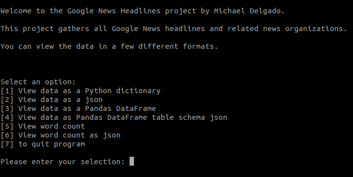
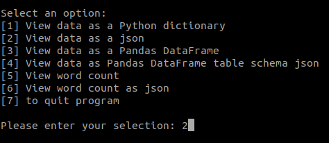
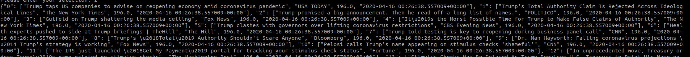

# Google News Headlines

>Returns all Google News headlines and related news organizations. Avaliable formates include: python dictionary, json, pandas DataFrame, pandas DataFrame as table schema json. Addtional class methods include word_count() and word_count_as_json().

<!-- [![NPM Version][npm-image]][npm-url]
[![Build Status][travis-image]][travis-url]
[![Downloads Stats][npm-downloads]][npm-url] -->

This is a python based project. The main script uses BeautifulSoup, Requests and Pandas python libraries. Once the class GoogleNewsHeadlines is instantiated, it gathers all of the Google News headlines, related organization and a python datetime timestamp.There are multiple GoogleNewsHeadlines class methods that allow you to view the data in different formats. Additionally, the class includes the word_count() and word_count_as_json() methods. These methods return each word from all the headlines combined and the number of times each word appears.

You can run the google_news_headlines.py file in your terminal and interact with the program terminal interface or you can import the class GoogleNewsHeadlines and use it in a Python REPL or in your own code. Continue reading to find out how.


## Installation

OS X & Linux:

```sh
git clone https://github.com/dev-mike-del/google_news_most_common_words.git
```


## Usage example

*Running the script in your terminal*

1. Create a python virtual environment. For this example, I am using [Virtualenv](https://virtualenv.pypa.io/en/latest).
```sh
virtualenv -p python3 your_virtualenv_name
```

2. Activate the python virtual environment
```sh
source your_virtualenv_name/bin/activate
```

3. Install the packages listed in requirements.txt.
```sh
pip install -r requirements.txt
```

4. Run google_news_word_count.py.
```sh
python google_news_headlines.py
```

5. View the options in the terminal.


6. Enter the corresponding number for your selection and click return (or enter)


7. View the results.


<!-- _For more examples and usage, please refer to the [Wiki][wiki]._ -->

<!-- ## Development setup

Describe how to install all development dependencies and how to run an automated test-suite of some kind. Potentially do this for multiple platforms.

```sh
make install
npm test
```

## Release History

* 0.2.1
    * CHANGE: Update docs (module code remains unchanged)
* 0.2.0
    * CHANGE: Remove `setDefaultXYZ()`
    * ADD: Add `init()`
* 0.1.1
    * FIX: Crash when calling `baz()` (Thanks @GenerousContributorName!)
* 0.1.0
    * The first proper release
    * CHANGE: Rename `foo()` to `bar()`
* 0.0.1
    * Work in progress -->

## Meta

Michael Delgado – [@dev_mike_del](https://twitter.com/dbader_org) – devmikedel@gmail.com

Distributed under the GNU General Public License v3.0. See [LICENSE](https://github.com/dev-mike-del/google_news_most_common_words/blob/master/LICENSE) for more information.

[https://github.com/dev-mike-del/google_news_most_common_words](https://github.com/dev-mike-del/google_news_most_common_words)

## Contributing

1. Fork it (<https://github.com/dev-mike-del/google_news_headlines/fork>)
2. Create your feature branch (`git checkout -b feature/fooBar`)
3. Commit your changes (`git commit -am 'Add some fooBar'`)
4. Push to the branch (`git push origin feature/fooBar`)
5. Create a new Pull Request

<!-- Markdown link & img dfn's -->
[npm-image]: https://img.shields.io/npm/v/datadog-metrics.svg?style=flat-square
[npm-url]: https://npmjs.org/package/datadog-metrics
[npm-downloads]: https://img.shields.io/npm/dm/datadog-metrics.svg?style=flat-square
[travis-image]: https://img.shields.io/travis/dbader/node-datadog-metrics/master.svg?style=flat-square
[travis-url]: https://travis-ci.org/dbader/node-datadog-metrics
[wiki]: https://github.com/yourname/yourproject/wiki