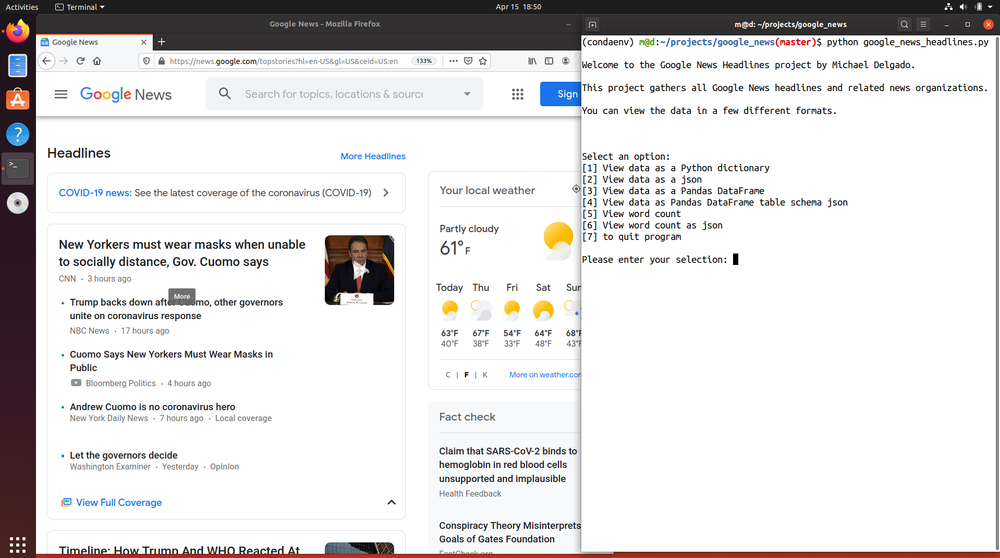

# Google News Word Count
> Returns a dictionary of each word and the number of times that word appears (in a headline) on Google News.

<!-- [![NPM Version][npm-image]][npm-url]
[![Build Status][travis-image]][travis-url]
[![Downloads Stats][npm-downloads]][npm-url] -->

This python script uses BeautifulSoup and Requests to collect all the words from each Google news headline. It returns a dictionary of each word and the number of times that word appears (in a headline) on Google News.



## Installation

OS X & Linux:

```sh
npm install my-crazy-module --save
```

<!-- Windows:

```sh
edit autoexec.bat
``` -->

## Usage example

Everytime this script is executed, it creates a new results list.

1. Create a python virtual environment. For this example, I am using [Virtualenv](https://virtualenv.pypa.io/en/latest).
```sh
virtualenv -p python3 your_virtualenv_name
```
2. Activate the python virtual environment
```sh
source your_virtualenv_name/bin/activate
```
3. Install the packages listed in requirements.txt.
```sh
pip install -r requirements.txt
```
4. Run google_news_word_count.py.
```sh
python google_news_word_count.py
```
5. View the results in the terminal.
```sh
{'word': 'coronavirus', 'appearances': 76}
{'word': 'us', 'appearances': 19}
{'word': 'trump', 'appearances': 14}
{'word': 'pandemic', 'appearances': 12}
{'word': 'aid', 'appearances': 8}
{'word': 'release', 'appearances': 8}
{'word': 'stimulus', 'appearances': 7}
{'word': 'up', 'appearances': 7}
{'word': 'live', 'appearances': 7}
{'word': 'microsoft', 'appearances': 6}
{'word': 'lockdown', 'appearances': 6}
{'word': 'windows', 'appearances': 6}
{'word': 'health', 'appearances': 6}
{'word': 'home', 'appearances': 6}
{'word': '2020', 'appearances': 6}
```

<!-- _For more examples and usage, please refer to the [Wiki][wiki]._ -->

<!-- ## Development setup

Describe how to install all development dependencies and how to run an automated test-suite of some kind. Potentially do this for multiple platforms.

```sh
make install
npm test
```

## Release History

* 0.2.1
    * CHANGE: Update docs (module code remains unchanged)
* 0.2.0
    * CHANGE: Remove `setDefaultXYZ()`
    * ADD: Add `init()`
* 0.1.1
    * FIX: Crash when calling `baz()` (Thanks @GenerousContributorName!)
* 0.1.0
    * The first proper release
    * CHANGE: Rename `foo()` to `bar()`
* 0.0.1
    * Work in progress -->

## Meta

Michael Delgado – [@dev_mike_del](https://twitter.com/dbader_org) – devmikedel@gmail.com

Distributed under the GNU General Public License v3.0. See [LICENSE](https://github.com/dev-mike-del/google_news_most_common_words/blob/master/LICENSE) for more information.

[https://github.com/dev-mike-del/google_news_most_common_words](https://github.com/dev-mike-del/google_news_most_common_words)

## Contributing

1. Fork it (<https://github.com/dev-mike-del/google_news_most_common_words/fork>)
2. Create your feature branch (`git checkout -b feature/fooBar`)
3. Commit your changes (`git commit -am 'Add some fooBar'`)
4. Push to the branch (`git push origin feature/fooBar`)
5. Create a new Pull Request

<!-- Markdown link & img dfn's -->
[npm-image]: https://img.shields.io/npm/v/datadog-metrics.svg?style=flat-square
[npm-url]: https://npmjs.org/package/datadog-metrics
[npm-downloads]: https://img.shields.io/npm/dm/datadog-metrics.svg?style=flat-square
[travis-image]: https://img.shields.io/travis/dbader/node-datadog-metrics/master.svg?style=flat-square
[travis-url]: https://travis-ci.org/dbader/node-datadog-metrics
[wiki]: https://github.com/yourname/yourproject/wiki